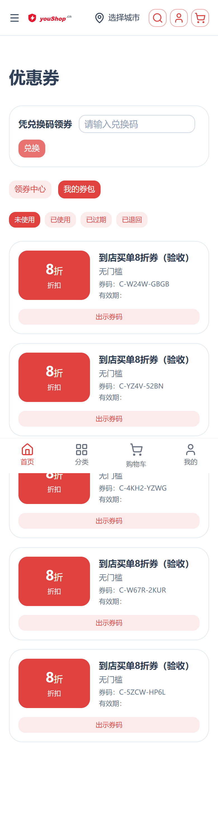
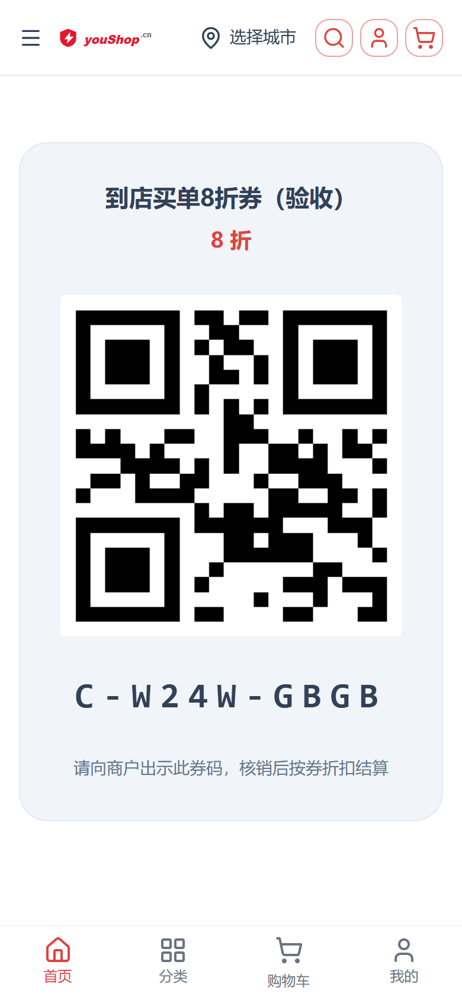

# 到店买单（顾客端）操作手册

## 功能说明
平台不收款。顾客领取「到店买单券」，到店向商户出示券码，商户核销后按券折扣线下结算。

## 领券
在「我的优惠券 / 券包」中查看已领取的到店买单券（使用场景为「到店买单」或「通用」）。

## 到店出示券码
1. 在券卡上点「出示券码」
2. 把二维码或券码出示给商户
3. 商户核销后，按券折扣付款给商户（平台不参与收款）

## 常见问题
- 看不到「出示券码」按钮：该券为「仅线上」场景，或已使用/已过期
