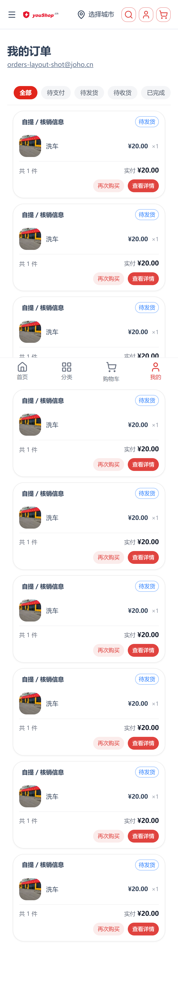
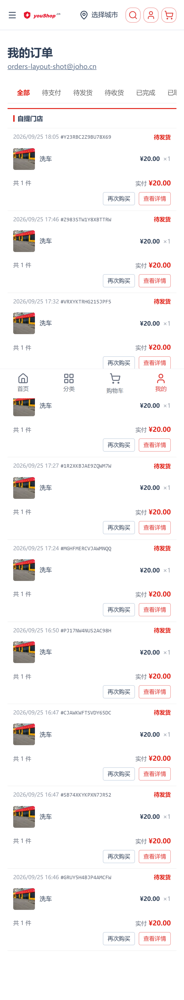
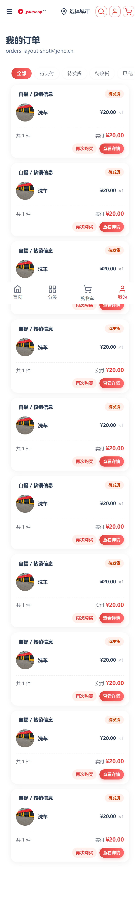
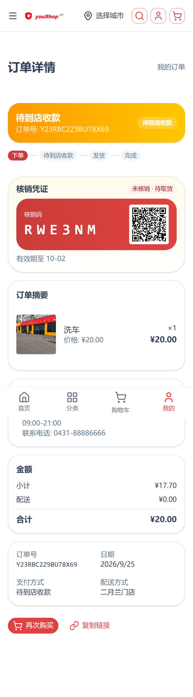
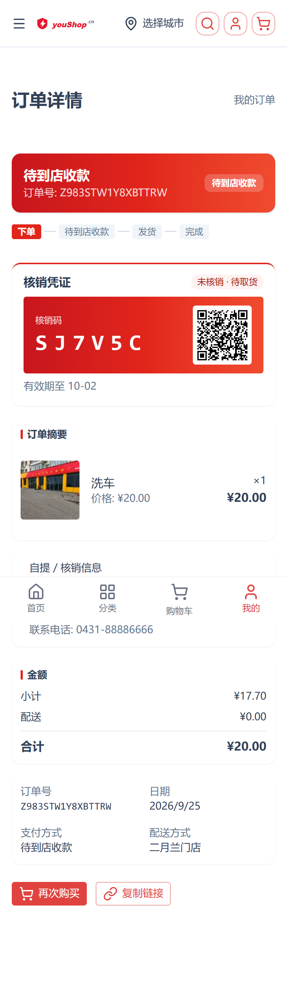
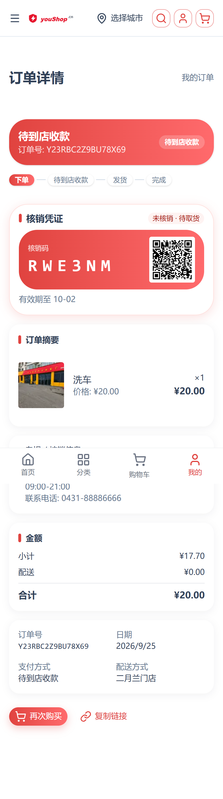
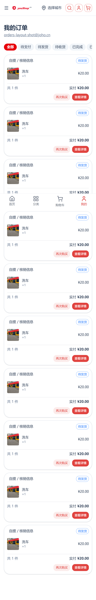

# 订单列表 / 订单详情 三版式（cn · jd · mall）— 操作手册

> 日期：2026-09-25
> 代码位置：`d:\zhao\nshop`（分支 `nshop`），前端 `layers/base`
> 页面：`/account/orders`（列表）、`/account/orders/<code>`（详情）
> 设计文档：[specs/2026-09-25-orders-multi-layout-cn-jd-mall-design.md](../../specs/2026-09-25-orders-multi-layout-cn-jd-mall-design.md)
> mockup 归档（视觉真源）：[mockups/orders-multi-layout/](../../mockups/orders-multi-layout/)
> 截图口径：**手机视口 390×844、dpr=2（780×1688）、fullPage**、`locale=zh-CN`
> （fullPage 截图里会出现一次底部固定导航栏压在内容上，那是 Chromium 拼接整页图时对 `fixed` 元素的固定表现，不是版式问题）

---

## 1. 一句话说明

订单**列表**与订单**详情**（自提·含核销码）各支持 3 套版式视觉：`cn`（国内电商风）、`jd`（京东风）、`mall`（商城/珊瑚红风）。
版式由**渠道（channel）的 `customFields.orderListConfig` / `orderDetailConfig`** 的 `layout` 字段决定，前端按版式选渲染容器，**后台可随时切换、无需改代码**。

## 2. 三版式一览（截图）

### 2.1 订单列表

| 版式 | 手机截图 | 视觉要点 |
|---|---|---|
| `cn` |  | 药丸 tab（选中红底白字 `#e1251b`）；`rounded-xl` 描边白卡 + 轻投影；状态描边丸徽标；药丸按钮 |
| `jd` |  | 下划线 tab（选中 2px `#e1251b` 下划线）；按**配送类型**分区（自营 / 自提门店），分区内平铺行无卡片；纯文字状态色；4px 圆角描边按钮 |
| `mall` |  | 珊瑚渐变药丸 tab；`rounded-[18px]` 大圆角投影卡（无描边）；实心浅底丸徽标；虚线底栏；珊瑚渐变实心 CTA |

### 2.2 订单详情（自提·含核销码）

| 版式 | 手机截图 | 视觉要点 |
|---|---|---|
| `cn` |  | 状态头按订单状态取语义渐变，`rounded-xl`；进度药丸；`rounded-xl` 描边区块卡（＝既有样式）；核销码琥珀高光卡 + `brand-600→brand-500` 码区 |
| `jd` |  | 固定京东红渐变状态头（`#c8161d → #e1251b → #f04b2f`），`rounded-md`；进度方块 `rounded-[3px]`；`rounded-md` 无描边区块 + 3px 红竖条标题；核销码白卡 + 2px 红顶边 |
| `mall` |  | 固定珊瑚渐变状态头（`#e0433f → #ff6a6c`），`rounded-2xl`；进度药丸 + 珊瑚渐变 + 投影；`rounded-[18px]` 投影区块 + 5px 珊瑚竖条标题；核销码 `#ffe0dd` 边 + 珊瑚投影 |

> 页面**外层标题栏/返回导航**不随版式变化（仍由页面既有 header 提供）——mockup 中的 navbar / sticky 标题卡属页面 chrome，未重复实现。

## 3. 如何切换版式

### 3.1 后台改渠道配置（推荐）

在 Vendure Admin（`https://e.joho.cn/admin-api`）对目标渠道写 `customFields`：

```json
{
  "orderListConfig":   "{\"version\":1,\"layout\":\"cn\"}",
  "orderDetailConfig": "{\"version\":1,\"layout\":\"mall\"}"
}
```

- **列表** `orderListConfig.layout` 可选：`card`（默认）\| `cn` \| `jd` \| `mall`
- **详情** `orderDetailConfig.layout` 可选：`jd`（默认）\| `classic` \| `confirmation` \| `cn` \| `mall`

Admin API（一步到位，同时改两个 key）：

```graphql
mutation($id:ID!, $cf:UpdateChannelCustomFieldsInput!) {
  updateChannel(input:{ id:$id, customFields:$cf }){ __typename }
}
# variables: { "id": "<channelId>",
#   "cf": { "orderListConfig":"{\"version\":1,\"layout\":\"mall\"}",
#           "orderDetailConfig":"{\"version\":1,\"layout\":\"mall\"}" } }
```

> 变量类型必须是 `UpdateChannelCustomFieldsInput!`（写成 `JSON!` 会被 Admin API 判为 400）。

> 渠道 customFields 字段定义见 `d:\zhao\vendure\packages\dev-server\dev-config.ts`
> （`orderDetailConfig` / `orderListConfig`，均为 `type: 'text'`、`public: true`）。

### 3.2 回退与容错（不会白屏）

| 情况 | 结果 |
|---|---|
| 未配置 / 空字符串 | 列表 → `card`、详情 → `jd`（沿用改动前默认） |
| JSON 写坏（非对象 / 解析失败） | 解析返回 `null` → 同上默认 |
| `layout` 写非法值（如 `"abc"`） | 白名单校验不通过 → 同上默认，不报错 |

### 3.3 不受影响的版式

- 列表 `card`：既有 `OrderCardList` 外观**逐字未动**（零回归），默认走它。
- 详情 `classic`（备用版式）、`confirmation`（结算确认场景）：**未改动**，渲染映射保持原样。

## 4. 本地复现（构建 + 截图）

本地构建产物**必须配一个同源反代**才可访问：前端恒用「同源 `/shop-api`」（生产由 Nginx 反代），
本地若直接把 `node .output/server/index.mjs` 暴露给浏览器，SSR/客户端的 GraphQL 请求会全部 404。

```powershell
# 1. 本地构建（铁律：本地构建，绝不在服务器构建）
cd d:\zhao\nshop
pnpm build

# 2. 起本地服务：Nuxt 构建产物监听 8081（.env 已指向线上 shop-api + 渠道 token）
$env:PORT="8081"; node .output/server/index.mjs

# 3. 起同源反代：8080 -> 本地 8081，并把 /shop-api* 转发到线上 Shop API
#    浏览器/探针一律访问 http://localhost:8080（= 反代入口）
$env:PROXY_PORT="8080"; $env:APP_PORT="8081"; python scripts\_shot_proxy.py

# 4. 跑探针：切渠道版式 → 390×844/dpr2 全页截图 → finally 还原渠道配置
python scripts\_shot_order_layouts.py
```

反代（`scripts\_shot_proxy.py`）的关键规则：

| 规则 | 值 | 原因 |
|---|---|---|
| `/shop-api*` | → `https://www.youshop.cn`，且 **Host 改写为 `www.youshop.cn`** | 上游虚拟主机按 Host 分流，不改写会 404 |
| 其他路径 | → `http://127.0.0.1:8081`，且 **保留浏览器原始 Host**（`localhost:8080`） | SSR 里 `useRequestURL().origin` 由此得出；若 Host 变成 `127.0.0.1:8081`，同源 `/shop-api` 会打到本地 Nuxt 上变 404 |
| 转发请求头 | 必须**先剔除原 `host` 头，再写一个新的 `Host`**（只留一个） | HTTP 头名大小写不敏感；原样透传会在 dict 里留下小写 `host`，再塞一个大写 `Host` 就变成**两个 Host 头** → openresty 直接 400（详见 §6） |

探针脚本 `scripts/_shot_order_layouts.py`（三版式 6 张图）与 `scripts/_shot_order_deeplink.py`（详情深链回归，见 §6.1 坑二）均为**本地探针**（`.gitignore` 忽略 `/scripts/_shot_*`，不提交），
`_shot_order_layouts.py` 的行为：登录取已登录会话 → 用该会话构一笔**自提单**并由 superadmin 结算（生成核销码）→
逐版式改写线上渠道 `orderListConfig`/`orderDetailConfig` → 截 6 张图 → **`finally` 立即还原渠道原值**。
截图直接写入本手册 `shots/` 目录（`/scripts/shots/` 已被 gitignore，不作为交付路径）。

> 深链回归（`_shot_order_deeplink.py`）跑法：`python scripts\_shot_order_deeplink.py`，
> 它用**带 cookie 但不执行 JS** 的请求取纯 SSR HTML 做断言（修复前后差异见 §6.1 坑二）。

## 5. 与 mockup 的已知偏差（有意为之，勿当 bug）

| mockup 元素 | 落地处理 | 理由 |
|---|---|---|
| 各版式顶部 navbar / sticky 标题卡 | 不实现，由页面既有 `<header>` 承担 | 页面 chrome 不因版式而变，避免标题重复 |
| 列表 jd 商家头部「联系客服 ›」 | 不实现 | 无对应处理逻辑，不落死链 |
| 列表 jd 按「商家名」分组 | 改为按**配送类型**分组（自营 / 自提门店） | `GetOrderHistory` 的 `OrderBase` 片段无商家名，不为此扩 GQL |
| 列表 cn/jd/mall「去支付」按钮 | **不实现** | 系统没有「对已有未支付订单发起支付」入口（支付只存在于结算流程内），补按钮只能落死链或误导；**已与用户确认记为已知偏差** |
| 列表 cn 状态徽标（浅底填充） | 复用既有 `OrderStateBadge` 描边丸 | 复用既有组件，语义色（warning/info/success/error）与全局一致 |
| 列表商品行「规格」副标题（如「黑色 · 128G」） | 不实现 | `OrderBase` 片段无规格/选项值字段，不为此扩 GQL |

## 6. 谁在共用同一批积木（改动影响面）

| 积木 | 是否支持 `variant` | 说明 |
|---|---|---|
| `OrderStatusBanner` / `OrderProgress` / `OrderRedemptionCard` / `OrderActions` | 是（`cn`\|`jd`\|`mall`） | 圆角/配色/码区渐变按版式变化 |
| `OrderCardActions` | 是（`cn`\|`jd`\|`mall`） | 列表卡片操作按钮：cn/mall 药丸、jd 4px 圆角 |
| `OrderItems` / `OrderTotals` / `OrderShippingBreakdown` / `OrderPickupCard` / `OrderAddress` / `OrderMetaCard` | 否 | 无版式差异，三版式原样复用 |

**`variant` 语义（重要）**：**不传 = 既有观感**（走主题默认）。
`OrderCard`（列表 `card` 版式）、`OrderDetailClassic`、`OrderDetailConfirmation` 均**不传** `variant`，故外观零回归。

**落地坑（已修，勿回退）**：列表取数 `useOrderList` 必须在 setup 中**同步调用（不要 `await`）**。
`<script setup>` 顶层 `await` 会把 setup 变成 async setup，而 Vue 在 setup 返回 Promise 后
**立即清空 `currentInstance`**（`runtime-core` 的 `reset()`），此后注册的 `onMounted` 会被**静默丢弃**
（生产构建无告警），表现为列表永远停在「请稍候…」且不发出任何请求。
因此该 composable 改用 `useAsyncGql` 的 immediate 在 setup 阶段同步取数，加载态由 `pending/error/data` 推导。

### 6.1 本地复现的两个坑（只在本地环境，不是业务代码缺陷）

**坑一：本地反代重复 `Host` 导致 SSR 侧所有 GraphQL 取数 400（会造成「版式切了没反应」的假象）**

症状：后台把渠道 `orderListConfig.layout` 改成 `cn`/`jd`/`mall` 都无效，列表恒为默认 `card`；
页面抛 `[GQL Error] {statusCode: 400, operation: GetChannelTheme}`，但浏览器里的同名请求却正常。

机制：Nitro SSR 的 `fetch` 是 undici，**头部名一律小写**，所以进来的头是 `host`；
而反代随后又写了一个大写 `Host` → 转给上游就是**两个 Host 头** → openresty 直接回
`400 Bad Request`。于是 **SSR 期间**的 `GetChannelTheme` / `GetShopGlobalConfig` / `GetShopTemplate`
全部失败 → SSR payload 里 `theme-channel-cfs`、`order-list-config` 等键都是 `null`
→ 列表版式回退 `card`。浏览器请求头部是首字母大写（`Host`），不产生重复，所以客户端侧正常。
（`useAsyncData` 会把 SSR 的 `null` 写进 payload，客户端 hydrate 后**不再重取**，所以症状会一直持续。）

修法：转发前按大小写不敏感地剔除 `host`，再写唯一一个 `Host`（见 §4 表第三行）。

**坑二：订单详情深链 / 硬刷新 404（既有缺陷，2026-09-25 已修）**

根因不在详情页，而在 `layers/base/plugins/gql-session.ts`：注入 `Authorization` 的那段被
`if (import.meta.client)` 挡住了。而登录态 `useAuthStore` 走 persistedstate 的 **cookies** 存储
（见 `pinia-plugin-persistedstate` 的 nuxt 运行时 `runtime/plugin.js` 默认 `storages.cookies()`），
SSR 阶段本来就能读到请求头里的 cookie —— 页面 `middleware/account.ts` 也正是靠这一点在服务端判登录。
于是 SSR 期 `GetOrderByCode` 不带 Authorization → `orderByCode = null` 写进 payload →
客户端 hydrate 后**不再重取** → 深链/硬刷新渲染「404 未找到订单」（从列表点入走客户端导航才正常，此时没有 SSR payload）。

修法：去掉那个 `import.meta.client` 限制，SSR 同样从 authStore 取 token（try/catch 兜底，取不到即等同游客，行为不变）。

回归（`scripts/_shot_order_deeplink.py`，390×844 / dpr2 手机视口；线上部署后的实拍见 §6.2.2）：

| 断言 | 修复前 | 修复后 |
|---|---|---|
| 纯 SSR HTML（不跑 JS）含订单号 /「订单详情」/「核销凭证」 | 否 | 是 |
| SSR `__NUXT_DATA__` 里有真实自提字段（`"pickup"`） | 否（null） | 是 |
| 页面渲染「未找到订单」 | 是 | 否 |

> 判据说明：`核销码` 这个 label 只在客户端 `OrderRedemptionCode` 取码返回后才渲染，
> SSR 里能看到的是核销卡标题「核销凭证」。故深链的 SSR 判据用「订单详情 + 核销凭证 + payload 含 pickup」，
> **不要用「核销码」**；而截图（走完整客户端流程）里应当能看到真实码值。

## 6.2 线上部署与回归（2026-09-25）

部署走 [scripts/deploy.mjs](../../../../scripts/deploy.mjs)（**本地构建 → scp `.output/` → 服务器解压/拷入 → `pm2 restart`**，服务器不构建、不装依赖）：

```powershell
cd d:\zhao\nshop
node scripts/deploy.mjs
# 读 .env 部署段：SERVER_HOST=joho、REMOTE_DIR=<openresty 站点目录>、SITE_PORT=3000、APP_NAME=nshop
```

部署对象 = 本地 HEAD（工作区干净，产物与提交一致），`nshop` 进程 `pm2 restart` 后 online；站点 `https://www.youshop.cn`。

### 6.2.1 线上订单列表（默认 `card` 版式）



断言（登录态，390×844 / dpr2）：出现 tab 栏（全部/待支付/待发货/待收货/已完成/已取消）与订单行（「自提 / 核销信息 · 洗车 ×1 ¥20.00 · 待发货」），**不再停在「请稍候…」**（修复前恒卡加载态，见 §6 落地坑）。

### 6.2.2 线上订单详情深链 / 硬刷新（自提单，含核销码）


| 断言 | 线上结果 |
|---|---|
| 纯 SSR HTML（不跑 JS、带 cookie）`status` | 200 |
| SSR HTML 含订单号 /「订单详情」/「核销凭证」 | 是（单号出现 34 次） |
| SSR `__NUXT_DATA__` 含真实自提字段（`"pickup"`） | 是 |
| SSR HTML 含「未找到订单」 | 否 |
| 真机路径（硬打开 / 硬刷新）含核销码且无「未找到订单」 | 是 / 无 |

线上回归探针用法（`scripts/_shot_order_deeplink.py` 支持用环境变量把探针指向线上，**不必起本地反代**；默认仍指向本地 `localhost:8080`）：

```powershell
$env:SHOT_BASE="https://www.youshop.cn"; $env:SHOT_OUT="d:\zhao\nshop\scripts\shots"
python scripts\_shot_order_deeplink.py
```

> 线上首屏较慢，探针必须先等 Nuxt hydration 完成再点登录，否则表单会走**原生 GET 提交**（凭据落到 query string、登录不生效）；脚本已内置该等待与重试。

## 7. 文件索引

| 文件 | 作用 |
|---|---|
| `layers/base/app/utils/order-config.ts` | 版式类型 + 白名单兜底（唯一解析入口，纯函数） |
| `layers/base/app/components/order/OrderListRenderer.vue` | 按 `layout` 选列表容器（`card`/`cn`/`jd`/`mall`） |
| `layers/base/app/components/order/OrderList{Cn,Jd,Mall}.vue` | 三个列表版式容器（新增） |
| `layers/base/app/components/order/OrderDetailRenderer.vue` | 按 `layout` 选详情容器（`jd`/`classic`/`confirmation`/`cn`/`mall`） |
| `layers/base/app/components/order/OrderDetail{Cn,Jd,Mall}.vue` | 三个详情版式容器（`Cn`/`Mall` 新增，`Jd` 重写对齐 mockup） |
| `layers/base/app/composables/useOrderList.ts` | 列表取数与过滤（4 版式共用，新增） |
| `layers/base/app/composables/useOrder{List,Detail}Config.ts` | 读渠道配置并解析出版式 |
| `layers/base/plugins/gql-session.ts` | GraphQL 会话注入；**SSR 也注入 Authorization**（修详情深链 404，见 §6.1 坑二） |
| `layers/base/i18n/locales/{zh-CN,en-US}.ts` | 新增词条 `messages.order.merchantPickup`（双语言同步） |