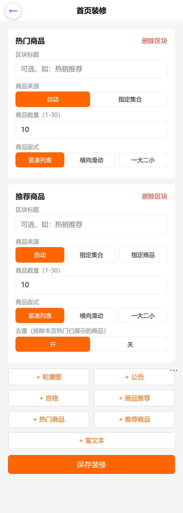
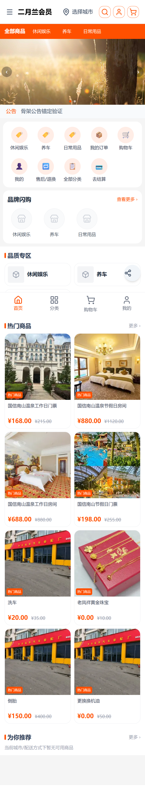
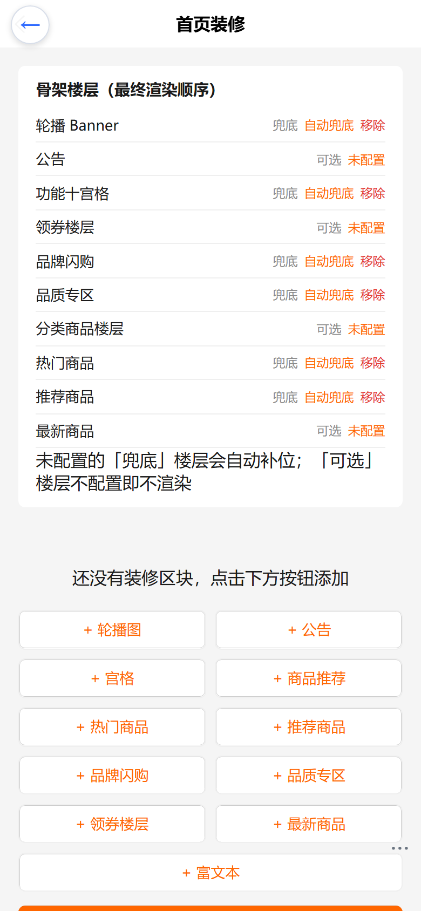
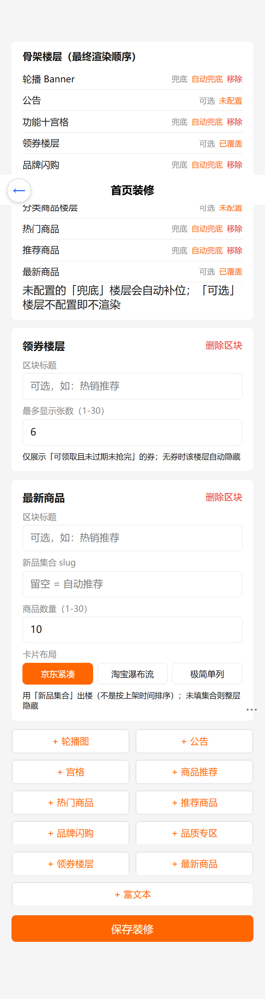
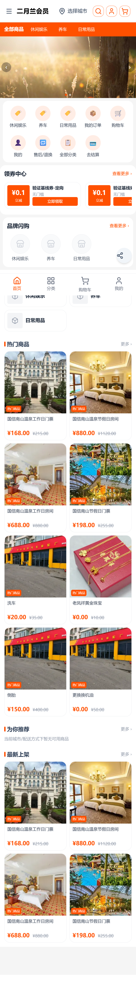
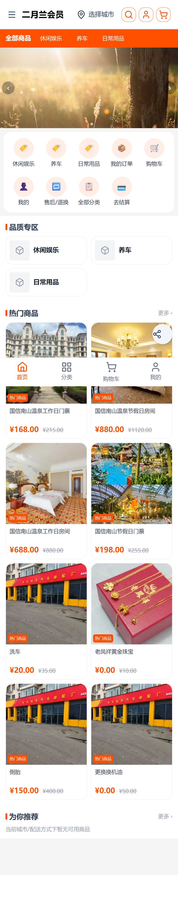
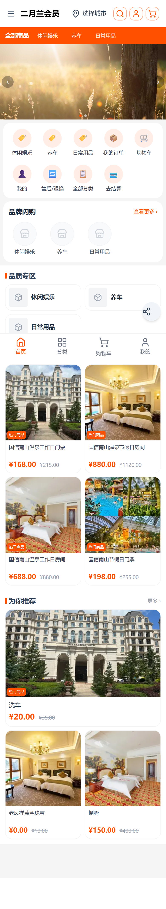

# t2（二月兰会员）前台可见性修复 · 操作手册与验收记录

> 范围：nshop C 端前台（首页可见性 / 城市口径 / 分类 / 断链 / 酒店版式 / 热门·推荐积木）+ Vendure 后端 `pickupLocations` 字段 + web-admin 装修后台
> 日期：2026-09-27
> 设计文档：`docs/superpowers/specs/2026-09-27-t2-storefront-visibility-and-blocks-design.md`
> 验收环境：线上 `https://www.youshop.cn/t2/`（手机视口 390×844，dpr=2）
> 本轮代号：**P0**（用户补充指令：「二月兰配送全部是长春地址统一」）+ **P1**（设计稿五项）

---

# P0：配送统一长春 + 首页可见性

## 一、P0 改动四件事

### ① 后端：`pickupLocations` 暴露省市字段（P0-A）

- 文件：`d:\zhao\vendure\packages\cjk-plugin\src\plugin.ts`（shop 端 `type PickupLocation`）
- 新增可空字段 `province / city / district / street`（实体列早已存在，此前 admin 端已暴露、shop 端未暴露）。
- 影响面：前台城市选择器可直接从自提点取「可用城市」，无需额外接口。

### ② 数据：t2 城市口径统一为「长春市」（P0-B）

- 脚本：`scripts/fix-t2-changchun-city.mjs`（幂等，可重复执行；执行前自动备份到 `d:\zhao\_backup\`）
- 改动对象（只动 t2 相关，**不动默认仓 id=3 与自提点**）：

| 对象 | 字段 | 改前 | 改后 |
|---|---|---|---|
| 商品 59 / 71 | `belongCity` | `长春` | `长春市` |
| 商品 59 / 71 | `serviceCities` | `[]` | `["长春市"]` |
| 商品 60 / 61 / 73 / 76 / 77 / 79 | `belongCity` | `null` | `长春市` |
| 商品 60 / 61 / 73 / 76 / 77 / 79 | `serviceCities` | `null` | `["长春市"]` |
| 库存地 id=6（t2 虚拟仓） | `serviceCities` | `null` | `["长春市"]` |

- 写入方式：**先读回完整 customFields → 合并目标字段 → 提交**，避免清掉 `deliveryMethods` / `kind` / `code` 等既有字段。
- 复核：二次运行输出「更新 0 / 跳过 9」，幂等成立；读回字段无丢失。

### ③ 前端：城市名匹配单一真源（P0-C）

- 新增 `layers/base/app/utils/city-match.ts`（纯函数，SSR 友好）：
  - `normalizeCity(name)`：trim + 去末尾「省/市/区/县」+ 小写（`长春市` ↔ `长春`）
  - `matchCity(a,b)`：归一化后 相等 ∨ 互为前缀；任一侧为空按「不判定 → 匹配」
  - `matchAnyCity(list, city)`：非数组/空数组/城市为空 = 不限制
- 口径关系：**本模块是后端 `stock-city-filter.ts:cityServes`（trim + lowercase 相等/前缀）的更宽松超集**——后端能匹配的，前端一定能匹配。
- 消费方：`productVisibility.ts`、`useCityService.ts`（原各自内联一份匹配逻辑，现统一引用此模块）。

### ④ 前端：未选城市时不再误杀商品（P0-C，**首页空白的主因**）

- 文件：`layers/base/app/utils/productVisibility.ts` → `isProductVisible()`
- 改动：`if (!ctx.city) return true;`（原逻辑在未选城市时 `canPickup` 恒为 `false`）。
- 原因：t2 是**单能力渠道（仅门店自提）**，前端被 `lockedMode` 锁成 `SELF_PICKUP`，而未选城市时 `city === belongCity` 恒不成立 → 首页 8 个商品全被过滤 → 楼层 `v-if` 全假 → 首页空白。
- 语义：未选城市时前端不掌握任何城市维度信息，只排除「已知不可达」。

### ⑤ 前端：可用城市列表 + 城市选择器快捷区（P0-C）

- 新增 `layers/base/app/composables/useAvailableCities.ts`，返回 `{ cities, loaded, ensureLoaded, isPickupOnly }`：
  - **仅自提渠道**：渠道能力就绪后自动预取 `pickupLocations` 的 `city` 去重（客户端执行，不增加 SSR 请求）。
  - **含快递渠道**：惰性聚合 `serviceCities`（`SearchProducts` → `GetProductsByIds`），城市面板打开时触发一次，缓存 + 并发去重 + 失败静默。
- `layers/base/app/components/header/CitySelector.vue`：面板顶部新增「可用城市」快捷区；**非空时替代「热门城市」区**，为空时保持原状（省/市两级列表与定位行为不变）。
- `layers/base/gql/queries/map.gql`：`GetPickupLocations` 增取 `province / city / district`。
- 词条：`nav.availableCities`，**12 个语言包全部补齐**（zh-CN / en-US / pt-BR / it-IT / fr-FR / fa-IR / es-ES / de-DE / ru-RU / bg-BG / ko-KR / ja-JP）。

---

# P1：设计稿五项（分类 / 断链 / 酒店 / 热门·推荐积木）

## 二、P1 改动五件事

### ⑥ 分类取数可靠化（用户问题 2「看不见分类」）

**根因（本地已复现）**：`useAsyncData` 的 handler 内调用 Nuxt composable（`useAsyncGql` / `useGql` 等）会丢 Nuxt 实例上下文，抛 `[nuxt] instance unavailable` 被 `catch` 吞掉 → 分类请求数 0、分类区渲染空壳。

- `app/app.vue`：setup 顶层捕获 `const rawGql = useGql()`，`loadMenuCollections()` 改为经 `rawGql({ operation: "GetMenuCollections" })` 调用（**无变量查询必须用对象形式**），失败重试一次 + `console.warn`。
- 新增 `layers/base/app/composables/useMenuCollections.ts`：单个 `useAsyncData`（key `menu-collections-prefetch`，`{ server: true, lazy: true, default }`）+ **800ms 超时护栏**（`fetchWithTimeout(() => rawGql(...), 800)`）；超时/失败时由 `app.vue` 的客户端兜底加载填充。
- 消费方：`app/pages/index.vue`（顶部分类，SSR 首帧即渲染）、`layers/base/app/pages/category/[slug].vue`。
- 请求耗时实测：root/default 1573–2480ms（护栏会超时 → 走客户端兜底），**t2 仅 116–327ms（护栏内命中，SSR 直出）**。

### ⑦ 商品断链修复（用户问题 3「点击商品没有进入详情页」）

- `layers/base/app/components/home/blocks/RecommendationRow.vue`：链接 `/products/` → `/product/`（路由实为 `pages/product/[slug].vue`，复数前缀 404）。
- `layers/base/app/components/home/jd/JdProductGrid.vue`：新增 `validProducts` 过滤**无 slug 商品**——否则会渲染出 `href="/product"` 的死链卡片（商品数据缺 slug 时静默不可点）。只 `console.warn` 一次，不阻塞其余商品。
- `layers/base/app/components/home/blocks/GoodsCardBlock.vue`：B/C 版式同口径过滤。

### ⑧ 酒店房型与酒店版式（用户问题 4「酒店变体商品无法显示」）

**数据**：`scripts/fix-t2-hotel-roomcfg.mjs`（幂等，执行前备份到 `d:\zhao\_backup\`）

| 变体 | 所属商品 | 改前 | 改后 |
|---|---|---|---|
| v58 | 60（房间） | `hotelRoomConfig = null` | 写入房型 JSON（604 字符） |
| v64 | 61（房间） | `hotelRoomConfig = null` | 写入房型 JSON（604 字符） |
| v57 | 59（门票） | 误挂房型 | 置 `null` |

- 两次执行「更新 3 → 更新 0/跳过 3」，幂等成立；`shippingProfileId / paymentProfileId / costPrice / barcode / internalCode` 全部保持原值（无字段丢失）。

**前端**：`layers/base/app/utils/detail-config.ts` 新增纯函数

- `parseHotelRoomConfig(variant)`：解析变体 `customFields.hotelRoomConfig`，坏 JSON / 缺字段返回 `null`。
- `productHasHotelRoom(variants)`：**任一变体**带合法房型即视为酒店商品。
- `isExplicitNonHotelLayout(config)`：仅 `floor` / `dualBuy` / `mall` 算「显式覆盖」，`classic` 不算。
- `resolveDetailLayout(config, variants)`：显式覆盖优先 → 否则按房型判定 → 否则 `classic`（默认）。

消费方：`ProductDetailRenderer.vue`（`layout = computed(() => resolveDetailLayout(config.value, productStore.product?.variants))`）、`DetailHotel.vue`（`isHotel = computed(() => productHasHotelRoom(productStore.product?.variants))`）。

> 库存与「能否看见」无关（线上取证：t2 八个商品变体 `stockLevel` 全为 `IN_STOCK`），本项不动库存 / 上架逻辑。

### ⑨ 装修积木新增「热门商品 / 推荐商品」（用户问题 1）

**Schema**（`layers/base/app/utils/shop-content.ts` + web-admin `src/templates/shared/schema.ts`）：

```ts
type GoodsCardLayout = 'compact' | 'sliding' | 'hero';   // A 紧凑 / B 横滑 / C 一大二小

interface HotGoodsSection {
  type: 'hot';
  title?: LocalizedText;
  source?: 'auto' | 'collection';   // 默认 auto（与京东兜底楼层同源 SearchProducts）
  collectionId?: string;
  limit?: number;                   // 默认 10，上限 30
  layout?: GoodsCardLayout;         // 默认 compact
}

interface RecommendGoodsSection {
  type: 'recommend';
  title?: LocalizedText;
  source?: 'auto' | 'collection' | 'slugs';
  collectionId?: string;
  slugs?: string[];
  limit?: number;
  layout?: GoodsCardLayout;
  dedupe?: boolean;                 // 默认 true：排除同页 hot 区块已展示的 productId
}
```

**前端**

- `HomeBlockRenderer.vue`：`componentMap` 增 `hot` / `recommend`（**绑组件对象**，不走字符串名，避免被当作 custom element 渲染成空标签）。
- `HotGoodsBlock.vue` / `RecommendGoodsBlock.vue`：解析本节配置 → `useCuratedGoods()` 取数 → `GoodsCardBlock.vue` 渲染。标题走 `LocalizedText` 回退链（当前 locale → defaultLocale → 首个值 → i18n 字典 `messages.home.hotGoods` / `messages.home.recommendGoods`）。
- `GoodsCardBlock.vue`：按 `layout` 三分支——`compact`（**直接复用 `JdProductGrid`**，视觉零回归）/ `sliding`（卡片 62% 宽 + `snap-x`，右侧露出下一张）/ `hero`（一大二小，大卡 `aspect-[16/9]` + 两张小卡 `grid-cols-2`）。
- `useCuratedGoods.ts`：与京东兜底楼层**完全一致的双层取数口径**
  1. 服务端：仅双能力渠道按渠道能力做 facet 过滤（`deliveryFacetFilter`）；命中 0 条时去掉 `facetValueFilters` 重查一次并置 `serverFiltered=false`，杜绝空白区块。
  2. 客户端：`isProductVisible` 做城市维度后置过滤。
  - 语言：商品名沿用 `?languageCode` 机制；标题走 `LocalizedText`。
  - 配送：与 `JdProductGrid` 共用同一份模块级状态（`useModuleDelivery('jd-grid')`），单能力渠道由 `lockedMode` 锁定（t2 → 自提）。
  - 划线价：`SearchProducts` → `GetProductsByIds` 补 `listPriceCents` + `customFields`。

**同页去重（`recommend` 的 `dedupe`）**：`useState('home-shown-product-ids')` 存**分桶登记表** `Record<区块key, productId[]>`，`recommend` 只排除**同页 `hot` 区块**的展示项，再按 `limit` 截断。去重开启时取数 `take=30` 先多取，避免排除后不足 `limit`。

> **两个 SSR 硬约束（本轮踩坑记录）**
> 1. `useState` 等 Nuxt composable **必须在首个 `await` 之前调用**——写在 `await useAsyncData(...)` 之后会丢 Nuxt 实例上下文，SSR 抛 `[nuxt] instance unavailable` 使**整页 500**（曾导致线上 t2 首页 500）。
> 2. 去重是**单向依赖**（只读 `hot` 的登记项）——若区块互相排除会造成反复重算 / 震荡。

**后台（web-admin）**

- `src/templates/shared/schema.ts`：新增两个接口 + `VALID_TYPES` 增 `hot` / `recommend` + `isValidShopContent` 校验（`limit` 正整数 ≤30；`layout` 在枚举内；`source='slugs'` 时 `slugs` 须为字符串数组）。
- `src/pages/decorate/home/index.vue`：`addHot()` / `addRecommend()` 两个按钮 + 配置面板（标题 / 来源 / 集合 ID / 商品 slug 列表 / 数量 / 版式三选一 / 推荐去重开关）+ `typeLabel()` 两分支。
- `src/locale/zh-Hans.json` / `en.json`：各补 18 个 `decorateHome.*` 词条。

### ⑩ 修复线上 t2 首页 500（本轮回归）

- 现象：`https://www.youshop.cn/t2/` 返回 `500 {"message":"[nuxt] instance unavailable"}`；`/`（默认租户）与 `/t1/` 正常。
- 定位：本地 dev 复现拿到完整堆栈 → `useCuratedGoods` 的 `useState` 位于 `await useAsyncData` 之后。
- 修复：`useState` 上提到首个 `await` 之前；同时修正去重口径（见 ⑨）。

---

## 三、验收结果（线上，2026-09-27）

### 3.1 接口与数据断言

| 断言 | 结果 |
|---|---|
| t2 `pickupLocations` 返回 5 条且 `city` 全为「长春市」（province 吉林省） | 通过（id 13/1/14/15/16） |
| 房间 v58 / v64 带房型 JSON，门票 v57 为 `null`，其余字段未丢失 | 通过 |
| `fix-t2-changchun-city.mjs` / `fix-t2-hotel-roomcfg.mjs` 二次执行幂等 | 通过（更新 0） |
| `pnpm typecheck` | 15 条存量错误，**零新增** |
| `pnpm vitest run` | 135 passed / 1 failed（`palette-presets` 期望 8 实得 9，**基线即失败**，与本次无关） |

### 3.2 手机视口验收（390×844 / dpr=2）

| # | 验收项 | 结果 | 截图 |
|---|---|---|---|
| 1 | t2 首页出现商品楼层（不再是空白） | 通过：去重后 8 个商品卡，无空态文案 | [01](shots/01-t2-home-nocity.png) |
| 2 | **未选城市 = 不过滤**（P0 核心） | 通过：干净 context 首屏即渲染 8 张卡 | [01](shots/01-t2-home-nocity.png) |
| 3 | 城市面板出现「可用城市」区且含「长春市」 | 通过：唯一条目「长春市」 | [02](shots/02-t2-city-panel.png) |
| 4 | 选中「长春市」后首页仍有商品 | 通过：顶栏「长春市」，楼层保留 8 张卡 | [03](shots/03-t2-home-changchun.png) |
| 5 | **分类可见**（问题 2） | 通过：首页 `/category/` 链接 28 个（含「全部商品」横条 + 品牌闪购 + 品质专区） | [08](shots/08-t2-home-fallback-hot-recommend.png) |
| 6 | 分类页可打开且有商品（问题 2/3） | 通过：`/t2/category/休闲娱乐` 4 个商品卡，无 404 | [04](shots/04-t2-category-page.png) |
| 7 | 点击商品进详情页，无死链（问题 3） | 通过：首页 `href` 无 `/product`（无 slug）死链；详情页 200 | [06](shots/06-t2-home-hotA-recommendC.png) |
| 8 | 酒店房间商品走酒店版式（问题 4） | 通过：`/t2/product/国信南山温泉节假日房间` body 含 `㎡` 与 `豪华大床` | [05](shots/05-t2-room-detail-hotel.png) |
| 9 | 反证：门票商品不走酒店版式 | 通过：`/t2/product/温泉门票` body **不含** `㎡` | — |
| 10 | 积木「热门商品」A 紧凑版式 | 通过：2 列紧凑卡 + 「热门商品」角标 + 划线价 | [06](shots/06-t2-home-hotA-recommendC.png) |
| 11 | 积木「推荐商品」C 一大二小 + 去重 | 通过：大卡「洗车」+ 两小卡「老凤祥黄金珠宝 / 倒胎」；与热门区块**无重复商品** | [06](shots/06-t2-home-hotA-recommendC.png) |
| 12 | 积木「热门商品」B 横滑版式 | 通过：卡片 62% 宽、右侧露出下一张（`snap-x`） | [07](shots/07-t2-home-hotB.png) |
| 13 | 线上 t2 首页恢复 200 | 通过：`/t2/`、`/t2/category/休闲娱乐`、`/t2/product/*`、`/t1/` 全 200 | — |
| 14 | 后台装修面板可见可用（问题 1 的运营入口） | 通过：按钮区出现「+ 热门商品」「+ 推荐商品」；面板含 标题/来源/数量(1-30)/版式(三选一)/去重；console 0 错误 | [09](shots/09-wa-decorate-hot-recommend-panels.png) |

> 已知存量问题（**非本轮引入**）：`/t1/` 与 `/t2/` 控制台有 `Hydration completed but contains mismatches.` 警告（默认租户 `/` 无此警告），与本轮改动无关。

### 3.3 积木版式截图取值方式（临时配置 → 截图 → 还原）

```bash
node scripts/verify-t2-blocks-config.mjs on-a   # nav row + hot compact(4) + recommend hero(3, dedupe)
python tmp/verify-t2-p1.py a                    # → 06-t2-home-hotA-recommendC.png
node scripts/verify-t2-blocks-config.mjs on-b   # nav row + hot sliding(6)
python tmp/verify-t2-p1.py b                    # → 07-t2-home-hotB.png
node scripts/verify-t2-blocks-config.mjs off    # 还原（shopContent = null，回到京东兜底楼层）
python tmp/verify-t2-p1.py off                  # → 08-t2-home-fallback-hot-recommend.png
```

- 脚本幂等、可重复执行；**每次写入前自动备份原值**到 `d:\zhao\_backup\t2-shopcontent-<时间戳>\backup.json`（只合并 `shopContent` 一个字段，读回完整 customFields 后提交）。
- **t2 当前线上状态 = `shopContent = null`（六兜底槽位自动补位）**：首页已有「热门商品」楼层 + 分类横条 + 品牌闪购 + 品质专区，问题 1/2 均已满足；装修积木（`hot` / `recommend` / `brandFloor` / `plaza` / `coupon` / `latest` 等）作为**运营可配的覆盖能力**，未配置的楼层由骨架**自动补位**（见下方第七节）。

## 四、装修积木「热门 / 推荐商品」后台用法

界面位置（手机 390×844 实测）：**装修 → 首页装修**，底部按钮区新增「+ 热门商品」「+ 推荐商品」；新增区块后即在页内展开配置面板。



1. 进入 web-admin → **装修 → 首页**（`https://e.joho.cn/guanli/#/pages/decorate/home/index`）。
2. 点「**+ 热门商品**」/「**+ 推荐商品**」新增区块，配置面板：
   - **区块标题**：留空走 i18n 默认（热门商品 / 为你推荐）；填了则按语言回退链（当前语言 → 默认语言 → 首个值）。
   - **商品来源**：`自动`（默认，与京东兜底楼层同源）/ `指定集合`（填集合 ID）/ `指定商品`（**仅推荐商品**，按商品 slug 指定，多行或逗号分隔）。
   - **商品数量**：默认 10，上限 30。
   - **商品版式**：`紧凑列表`（默认，复用京东楼层视觉）/ `横向滑动`（卡片 62% 宽横滑）/ `一大二小`（首图大卡 + 两小卡）。
   - **去重**（**仅推荐商品**）：默认「开」，排除同页「热门商品」区块已展示的商品。
3. 点「**保存装修**」后 t2 首页即按新区块渲染；**清空全部区块**则回到「六兜底槽位全部自动补位」的默认首页。

> **注意（2026-09-28 起语义已变更）**：装修配置存在时**不再整体关闭**京东兜底楼层，改为「按槽位自动补位」——详见第七节。运营只加「热门 + 推荐」时，品牌闪购 / 十宫格 / 品质专区等未覆盖的兜底楼层**仍然渲染**。

## 五、回归步骤（可复现）

```bash
# 1) 数据口径复核（幂等，安全）
node scripts/fix-t2-changchun-city.mjs        # 期望「更新 0 / 跳过 9」
node scripts/fix-t2-hotel-roomcfg.mjs         # 期望「更新 0 / 跳过 3」

# 2) 单测
pnpm vitest run layers/base/app/utils/city-match.test.ts \
               layers/base/app/utils/productVisibility.test.ts \
               layers/base/app/utils/shop-content.test.ts

# 3) 装修配置写入 / 还原
node scripts/verify-t2-blocks-config.mjs show   # 只读打印当前 shopContent

# 4) 手机视口验收截图（390×844 dpr=2）
python tmp/verify-t2-p1.py a|b|off              # 产出交付截图（见 3.3）
```

## 六、本轮遗留

| 项 | 状态 |
|---|---|
| 装修积木是否在 t2 长期启用 | 待运营决定，当前线上为 `shopContent = null`（六兜底槽位自动补位） |
| `/t1/`、`/t2/` 控制台 hydration mismatch 警告 | 存量，未定位（默认租户 `/` 无此警告；`/t2/category/all` 分类页同样出现，不在本次改动面），与本轮无关 |
| `palette-presets.spec.ts` 期望 8 实得 9 | 存量单测失败，未修 |
| 裸路径 `/t2/product/`（无 slug）返回 404 | 既有路由定义要求 slug（`pages/product/[slug].vue`），`/`、`/t1/`、`/t2/` 三租户一致 404，非缺陷；回归统一用带 slug 的真实商品 URL |

---

# 七、首页骨架自动补位（2026-09-28）

> 设计文档：`docs/superpowers/specs/2026-09-28-home-skeleton-fallback-design.md`
> 实施计划：`d:\zhao\vshop\web-admin\docs\superpowers\plans\2026-09-28-home-skeleton-fallback-plan.md`
> 线上验收：`https://www.youshop.cn/t2/`（手机视口 390×844，dpr=2）

## 7.1 骨架槽位表与自动补位顺序

「京东兜底楼层」被抽象为 **10 个骨架槽位**，槽位顺序**即最终渲染顺序**（分类导航不占槽位、由页面常驻渲染在最上方）：

| # | 槽位 key | 对应区块类型 | 类型 | 未配置时 |
|---|---|---|---|---|
| 1 | `banner` | `banner` 轮播 Banner | 兜底 | 自动补位（无图时占位） |
| 2 | `notice` | `notice` 公告 | 可选 | 不渲染 |
| 3 | `functionGrid` | `nav` 功能十宫格 | 兜底 | 自动补位 |
| 4 | `coupon` | `coupon` 领券楼层 | 可选 | 不渲染 |
| 5 | `brandFloor` | `brandFloor` 品牌闪购 | 兜底 | 自动补位 |
| 6 | `plaza` | `plaza` 品质专区 | 兜底 | 自动补位 |
| 7 | `goods` | `goods` 分类商品楼层 | 可选 | 不渲染 |
| 8 | `hot` | `hot` 热门商品 | 兜底 | 自动补位（与兜底搜索同源） |
| 9 | `recommend` | `recommend` 推荐商品 | 兜底 | 自动补位（与兜底搜索同源） |
| 10 | `latest` | `latest` 最新商品 | 可选 | 不渲染 |

**合并规则**（纯函数 `resolveHomeSections`，见 [home-skeleton.ts](file:///d:/zhao/nshop/layers/base/app/utils/home-skeleton.ts)）：

1. `shopContent = null` / `sections` 非数组 → **6 个兜底槽位全部自动补位**，4 个可选槽位不产出；
2. 运营区块按「同类型取第一个未被消费的」覆盖对应槽位，并**保留其全部配置**；
3. 槽位 key ∈ `hiddenSlots` → 该槽位**无论覆盖还是补位都不产出**；
4. 未被任何槽位消费的区块（含 `richText`）按原序**追加到骨架末尾**；
5. 未知 `type` 一律丢弃，不阻断其它槽位。

**请求数红线**：兜底态下热门/推荐槽位复用页面单次 `home-fallback-search`（`SearchProducts` take=20 后切 10+10），**不新增商品搜索请求**；运营用 `hot`/`recommend` 覆盖后才走各自的取数逻辑。

## 7.2 公告锚定在十宫格上方

`notice` 槽位排在 `functionGrid` **之前**（上表 #2 < #3），因此运营添加公告区块后，公告条渲染在功能十宫格**上方**、Banner 下方。



> 截图对应**断言 3**：`sections=[notice]` 时公告出现在十宫格上方，且品牌闪购 / 品质专区 / 热门 / 推荐兜底槽位仍在。

## 7.3 领券 / 分类商品楼层 / 最新商品怎么配

后台位置：**装修 → 首页装修**，底部按钮区新增四个按钮 ——「+ 品牌闪购」「+ 品质专区」「+ 领券楼层」「+ 最新商品」。



| 楼层 | 配置项 | 说明 |
|---|---|---|
| 领券楼层 `coupon` | 区块标题 / 最多显示张数（1-30，默认 6） | 数据来自 shop 侧券中心；**无可用券时整层自动隐藏**（不会出现空壳） |
| 最新商品 `latest` | 区块标题 / 新品集合 slug / 商品数量（1-30）/ 卡片版式 | 用「集合」表达「最新」（Vendure 搜索排序只有 name/price，无 createdAt）；**集合 slug 留空则整层隐藏** |
| 品牌闪购 `brandFloor` | 区块标题（留空走 i18n `品牌闪购`） | 数据自顶部分类，无需其它配置 |
| 品质专区 `plaza` | 区块标题（留空走 i18n `品质专区`） | 数据自顶部分类，无分类时整层隐藏 |
| 分类商品楼层 `goods` | 集合 ID / 数量 / 版式 | 已有能力；未填集合则按自动推荐出楼 |



> 截图对应**断言 4**：`sections=[coupon, latest]` 时，领券楼层出现在十宫格下方、最新商品出现在推荐之后，且未覆盖的兜底槽位（品牌闪购 / 品质专区 / 热门 / 推荐）仍在。见下图：



## 7.4 如何移除某个兜底楼层（hiddenSlots）

后台**装修 → 首页装修 → 顶部「骨架楼层（最终渲染顺序）」只读区**：每个**兜底**槽位右侧有「移除 / 恢复」开关（**可选**槽位无兜底、不提供移除）。点「移除」即把该 key 写入 `shopContent.hiddenSlots`，**保存装修**后前台即不再渲染该楼层。

- 状态语义：`已移除` > `已被覆盖` > `自动兜底` > `未配置`（优先级从高到低）。
- 支持「只移除、不加区块」的表达：`sections: []` + `hiddenSlots: ['brandFloor']` 是合法配置。



> 截图对应**断言 5**：`hiddenSlots: ['brandFloor']` 后品牌闪购消失，品质专区 / 热门 / 推荐兜底槽位仍在。

另一个对照：**断言 2** —— 运营只写 `sections=[hot, recommend]` 时，品牌闪购 / 十宫格 / 品质专区**都还在**（改动前会整体消失）：



兜底默认态（`shopContent = null`，**断言 1**）：分类导航 + Banner + 十宫格 + 品牌闪购 + 品质专区 + 热门商品；t2 全站仅 8 个商品，故「热门」出 8 张卡、「推荐」切片 `10..20` 为空（与改动前一致）。


## 7.5 线上回归结果（2026-09-28）

| # | 断言 | 结果 | 证据 |
|---|---|---|---|
| 1 | `shopContent = null` → 六兜底槽位自动补位（无公告/领券/最新商品） | 通过 | 标记 品牌闪购/品质专区/热门商品/为你推荐 全在；SSR payload `home-fallback-search` 1 条、`goods-block-` 0 条 | [12](shots/12-t2-skeleton-01-fallback-only.png) |
| 2 | `sections=[hot, recommend]` → 品牌闪购 / 十宫格 / 品质专区**仍在** | 通过 | 品牌闪购@5261、品质专区@7093、📦@3570 均在 mobile 段 | [13](shots/13-t2-skeleton-02-hot-recommend.png) |
| 3 | `sections=[notice]` → 公告在**十宫格上方** | 通过 | index(公告 2672) < index(📦 3856) | [14](shots/14-t2-skeleton-03-notice-anchor.png) |
| 4 | `sections=[coupon, latest]` → 领券在十宫格下、最新商品在推荐后，兜底仍在 | 通过 | 📦(3570) < 领券中心(5256)；为你推荐(20013) < 最新上架(20491)；品牌闪购/品质专区仍在 | [15](shots/15-t2-skeleton-04-coupon-latest.png) |
| 5 | `hiddenSlots=['brandFloor']` → 品牌闪购消失、其余兜底仍在 | 通过 | 品牌闪购不在 mobile 段；品质专区@5290、📦@3570、热门商品@6994、为你推荐@15565 | [16](shots/16-t2-skeleton-05-hidden-brand-floor.png) |
| 6 | `shopContent = null` 时兜底商品搜索仍为 **1 次** | 通过 | 浏览器客户端 `SearchProducts` 0 次（全部由 SSR 完成）；SSR payload `home-fallback-search` 1 条、无 `goods-block-*` 取数 | — |
| 7 | 五路径全 200，控制台无 `[nuxt] instance unavailable` | 通过 | `/`、`/t1/`、`/t2/`、`/t2/category/all`、`/t2/product/温泉门票` 全 200；6 次页面加载 `instance unavailable` **0 条** | — |
| — | 单测 | 通过 | 新增 19 passed（`home-skeleton` 16 + `shop-content` 3）；`typecheck` 15 条存量错误、零新增 | — |

### 7.5.1 截图取值方式（临时配置 → 截图 → 还原）

```bash
# 截图脚本（本仓库 _e2e/ 默认被 gitignore，脚本以 -f 强制入库）
#   逐变体切换 shopContent 后拍摄；产物 _e2e/shots/01..05-*.png（宽 780px = 390×2）
python _e2e/shot_home_skeleton.py 01-fallback-only
# 变体写入 / 断言 / 还原由一次性回归脚本完成（不提交，位于 d:\zhao\_backup\t2-skeleton-regression.mjs）
node d:/zhao/_backup/t2-skeleton-regression.mjs variant fallback-only   # 断言 1、6
node d:/zhao/_backup/t2-skeleton-regression.mjs variant hot-recommend   # 断言 2
node d:/zhao/_backup/t2-skeleton-regression.mjs variant notice          # 断言 3
node d:/zhao/_backup/t2-skeleton-regression.mjs variant coupon-latest   # 断言 4
node d:/zhao/_backup/t2-skeleton-regression.mjs variant hidden-brand    # 断言 5
node d:/zhao/_backup/t2-skeleton-regression.mjs restore                 # 还原为原值（t2 = null）
```

- 回归脚本**首次写入前**把原值备份到 `d:\zhao\_backup\t2-skeleton-original.json`，`restore` 按备份还原并读回复核（本次复核结果：`还原完成，校验=OK → null`）。
- 后台截图（10 / 11）由 `d:\zhao\_backup\shot_wa_decorate.py` 生成：登录 `https://e.joho.cn/guanli/` 后写入 `wa_channel_token=66ruvnhh34svhckaa2i`（t2 渠道）、`wa_channel_code=t2`，仅切换展示、**不保存**任何数据。

