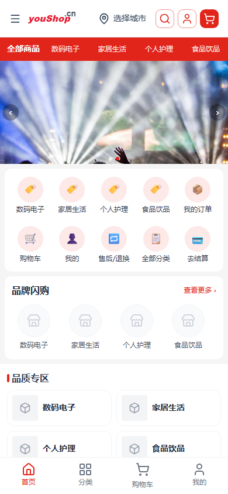
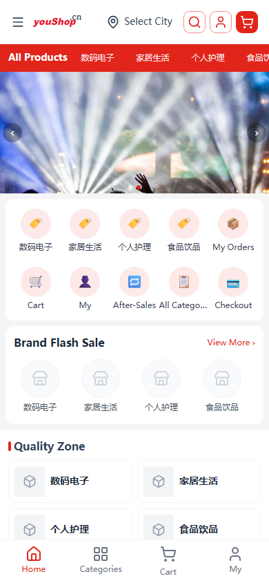

# 品牌名替换：Nuxtless → 优商铺 / youshop.cn

- 日期：2026-09-05

- 状态：已交付 & 已上线 & 生产验证通过

- 影响范围：全站标签页标题 / SEO（SchemaOrg、OG） / 商品·分类面包屑的品牌名

## 目标

将 nshop 首页等处的品牌名 "Nuxtless" 按语言区分替换：

- 中文（`zh-CN`）→ **优商铺**

- 非中文（`en-US` / `ru-RU` / `fr-FR` / `ja-JP` / `es-ES` / `de-DE` / `it-IT` / `pt-BR` / `ko-KR` / `fa-IR` / `bg-BG`）→ **youshop.cn**

## 背景 / 定位

全站品牌文字来自 i18n `messages.site.title`，用于：浏览器标签页标题（`default.vue`）、SEO 结构化数据（`app.vue` 的 SchemaOrg `defineWebSite` / `defineWebPage`）、OG 图片（`defineOgImage`）、产品与分类页面包屑（`product/[slug].vue`、`category/[slug].vue`）。首页 visible 的 "Nuxtless" 即由此渲染。

> 头部的 `logo-top.svg`（"youShop.cn"）与京东风格 PC 顶栏 `JdPcHeader`（"youShopJD"）本就是英文品牌图/硬编码，**不是 "Nuxtless"**，本轮未改动。

## 变更文件

12 个语言包 `site.title`：

| 文件                                                                                                                                           | 改前       | 改后         |
| -------------------------------------------------------------------------------------------------------------------------------------------- | -------- | ---------- |
| `layers/base/i18n/locales/zh-CN.ts`                                                                                                          | Nuxtless | 优商铺        |
| `en-US.ts` / `ru-RU.ts` / `fr-FR.ts` / `ja-JP.ts` / `es-ES.ts` / `de-DE.ts` / `it-IT.ts` / `pt-BR.ts` / `ko-KR.ts` / `fa-IR.ts` / `bg-BG.ts` | Nuxtless | youshop.cn |

## 部署

遵守部署铁律：本地构建 → scp 上传 `.output/` → pm2 restart（服务器不构建）。

```
pnpm build               # 本地构建通过（1365 modules，Server built 11.7s）
SKIP_BUILD=1 node scripts/deploy.mjs
  目标 qing:/opt/1panel/.../www.youshop.cn/index · APP=nshop · PORT=3000
```

pm2 进程 `nshop` restart 后 **online**，服务器本地 `curl localhost:3000/` 返回 **200**。

## 生产验证

| 断言           | 中文  | 英文         |
| ------------ | --- | ---------- |
| 首页 `<title>` | 优商铺 | youshop.cn |
| 服务器健康检查      | 200 | 200        |
| 页面错误         | 无   | 无          |

手机视口（390×844）验收截图：





## 说明与后续

- 本轮仅替换品牌名 `title`；各语言包 `description` 里的 "Nuxtless is a … starter project" 模板营销文案未动，若需一并改写可另行迭代。

- 中文版头部 logo 图仍为英文品牌标 "youShop.cn"（SVG 图形资源，两种语言通用）；如中文版需「优商铺」logo，需另绘 `public/logo-top.svg` / `logo-full.svg`。

- 注：此次为全量构建部署，工作区中当时未提交的 checkout/订单相关改动也一并进入生产。

