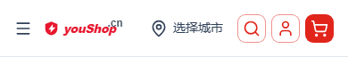
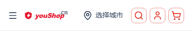

# 品牌视觉：闪电徽标替换 + 移动端购物车描边

- 日期：2026-09-05
- 状态：已交付 & 已上线 & 生产验证通过
- 影响范围：favicon（浏览器标签页）/ 全站 logo_top·logo_full / OG·SchemaOrg 引用 / 移动端头部购物车图标样式

## 目标

将 nshop 原 Nuxtless 品牌视觉统一为「**红盾 + 白色闪电**」徽标，并把移动端头部「实心红色」购物车改为与相邻功能图标一致的「**红色描边**」样式。

## 设计来源

一路从「Y 字形」→「皇冠（即 Y 变形）」→「胜利/品质/第一等意象」展开概念探索，最终用户选定 **19 号「盾 + 闪电」**：红盾表「品质·可信」，白闪电表「优选·高效·电速胜出」。favicon 用小而简、红白高对比的方案；logo 文件保留「徽标 + youShop.cn 品牌字」。

## 变更文件

| 文件 | 说明 |
| --- | --- |
| `public/favicon.svg` | 由绿色「N」形→ 红盾+白闪电（32×32） |
| `public/logo-top.svg` | 徽标 + youShop.cn 字体横排（顶部导航） |
| `public/logo-full.svg` | 徽标居上 + 品牌字竖排（页脚/账号页/SchemaOrg） |
| `layers/base/app/components/cart/CartTrigger.vue` | 购物车 `UButton` 补 `variant="outline"`（实心→描边） |

> 三个 SVG 文件名与原有引用路径一致（`/favicon.svg`、`/logo-top.svg`、`/logo-full.svg`），故 `nuxt.config.ts`、`app.config.ts`、`app.vue`（OG 底图）、`schema/identity.ts` 全部引用自动生效，无需改组件/配置。

## 部署

遵守部署铁律：本地构建 → scp 上传 `.output/` → pm2 restart（服务器不构建）。

```
pnpm deploy            # 注意：pnpm 内置 deploy 命令会冲突，须用 pnpm run deploy
  目标 qing:/opt/1panel/apps/openresty/openresty/www/sites/www.youshop.cn/index
  APP=nshop · PORT=3000 · 本地 build 约 13s
```

pm2 进程 `nshop` restart 后 **online**。

## 生产验证

| 断言 | 结果 |
| --- | --- |
| 首页 `<title>` | 优商铺 |
| `link[rel="icon"]` | 存在（1 处） |
| `/favicon.svg` HTTP | 200 + 含 `#E6162D` |
| `/logo-top.svg` HTTP | 200 + 含 `#E6162D` |
| `/logo-full.svg` HTTP | 200 + 含 `#E6162D` |
| 头部 logo 图数量 | 2 |
| 页面错误 | 无 |

移动端（390×844）验收截图：





## 说明与后续

- 移动端页脚按设计仅在 `lg(≥1024px)` 显示，故手机视口抓不到页脚图；`logo-full.svg` 已通过 HTTP 200 + 内容（含红盾）校验确认生效，桌面端与账号登录页正常展示。
- `CartTrigger` 为共享组件，购物车描边同时作用于桌面头部，与全局搜索/用户按钮统一；若桌面需保留实心，可再按断点分离。
- 可选优化（未实施）：移动端头部与购物车并排图标若希望与 logo 的红色有更好层级，可考虑将购物车红色描边饱和微调；闪电符号如需更强记忆点，可加折角增强辨识度。